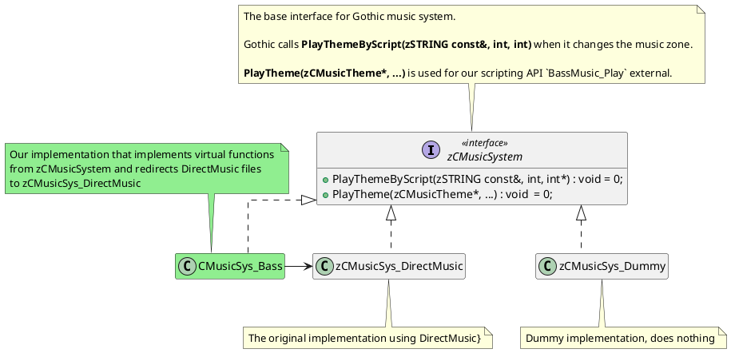

---
hide:
  - toc
---

# Architecture

zBassMusic is a native plugin for Gothic games built with [union-api](https://gitlab.com/union-framework/union-api)
library.
The Union API hooks into original Gothic process, loads our code and let us create hooks for the Gothic functions.
With this approach we can run our code in Gothic and change the behavior of the original code.

The core action we take is to hook into the Gothic initialization procedures and replace the global pointer to the
original
music system with a pointer to our own implementation. Because other parts of Gothic are using the global pointer to
interact
with the music system, we catch all the use cases and take full control.

## Gothic Music System

Conveniently, Gothic defines the music system as a pure virtual class (interface) and DirectMusic is only an
implementation,
alongside with a Dummy implementation used when the music is disabled. Thanks to this, we can just implement the
interface to provide our own virtual functions.

When the project started, a lot of code was inside the `CMusicSys_Bass` class to behave similar as the original system.
After refactoring motivated by changes in v0.2.x and v0.3.x, we have moved almost all processing to the `NH::Bass`
classes and now `CMusicSys_Bass` is just a simple bridge to get the events from Gothic and push them on a command queue. 

## Control Flow

...

## Engine

...

### CommandQueue

...

### EventManager

...

## MusicManager

...

### MusicTheme

...