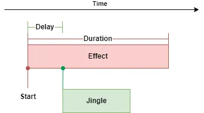

# Jingle

Jingle plays an additional audio file in-between transitioning songs. You can use it, for example to transition
from fight music to standard music with a nice finish sound. To define it you need:

* Audio File - audio file located in `_work/Data/Music`
* Delay - delay in seconds from the start of ending transition before the jingle starts 

Jingle works alongside Default and Timing, scheduling itself on every transition.



## Daedalus

TO set up jingle, you have to add it to a theme using Daedalus API.

```dae
BassMusic_AddJingle(
    "MyThemeToTransition", // theme
    "OC_DAY_STD",          // filter; this works only on MyThemeToTransition->OC_DAY_STD transition
    "JingleFile.wav",      // audio file
    1.0                    // delay in seconds
);
```

Only one Jingle can be configured for (theme, filter) pair, but you can have multiple Jingles with different filters.