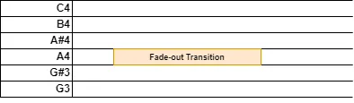
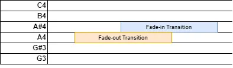
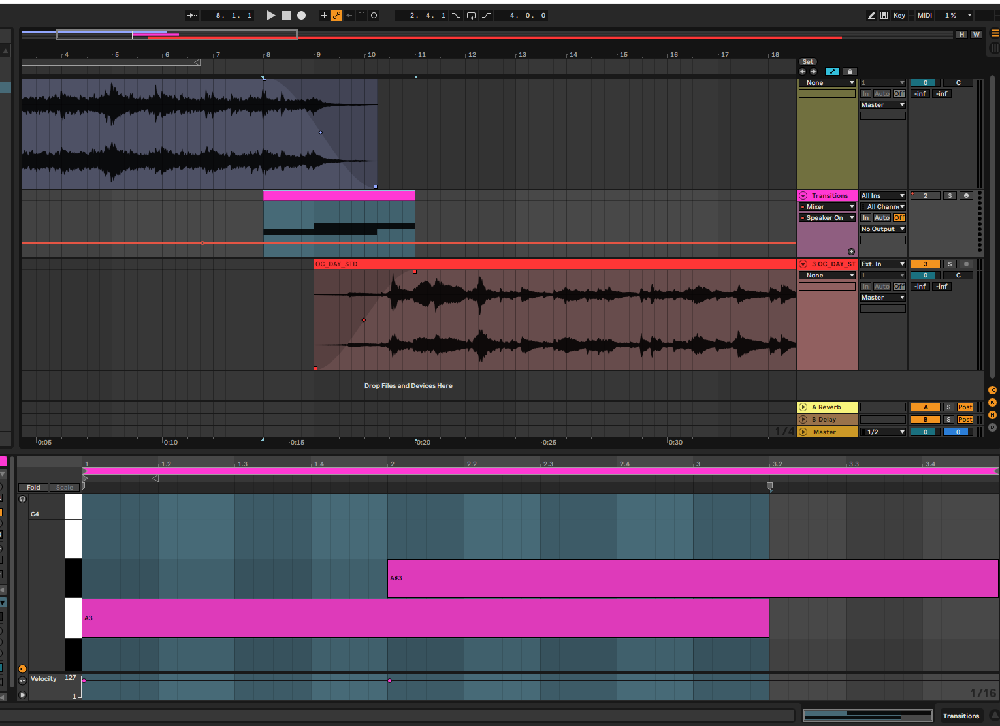

# MIDI Files

MIDI files can be used to set up time-depended properties for the transitions.
A MIDI file:

* has the same duration and tempo as the song
* uses notes to mark time spans (press + release pair)
* if song has a variable tempo, MIDI file must emit TEMPO events (should be done by DAW)

## Usage

MIDI files are located in `_work/Data/Music`.

### Default Transition (Instance)

```dae
instance MyTheme_Audio(BassMusic_ThemeAudio) {
    // skipped
    midiFile = "mytheme.mid";
    // skipped
};
```

### Default Transition (API)

```dae
BassMusic_AddMidiFile("MyTheme", "", "mytheme.mid");
```

### Filtered Transition (API)

```dae
BassMusic_AddMidiFile("MyTheme", "TargetTheme", "mytheme.mid");
```

## Notes

### Timing

#### A4 (Fade-out)

A4 note marks a [Timing Transition](timing.md) with CROSSFADE effect. The note position is the start of transition
and the note duration is the fade-out duration. By default, the next song fade-in has the same timing unless you
set up A#4.



#### A#4 (Fade-in)

A#4 note is an optional addition to A4 (Fade-out) that sets up the start and duration of the fade-out effect.



## Working in DAW

You can create the MIDI file as an additional track in your song project. This approach guarantees that the timing 
is consistent. During export, please export the MIDI track as an additional file that contains only this track.

For transitions, you can simulate them using the automation tools in your DAW and place the MIDI notes based on that.

