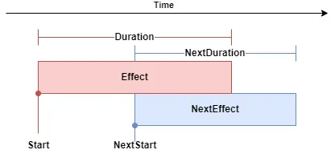

# Timing

Timing settings let you limit on which moments a transition may happen and what time spans to use for effects.
To define it, we are using a set of parameters:

* Start - when to start the end effect of the ending theme
* Duration - how long the end effect of the ending theme takes
* Effect - which end effect to use for the ending theme
* NextStart - when to start the start effect of the starting theme
* NextDuration - how long the start effect of the starting theme takes
* NextEffect - which start effect to use for the starting theme



## Effects

### NONE = 0

Disables the transition effect.

### CROSSFADE = 1

Uses fade-in and fade-out effects.

## Daedalus

To set up a timing transition, you have to add a time point to a theme using the Deadalus API.

```dae
BassMusic_AddTransitionTimePoint(
    "MyThemeForTransition", // theme
    "",                     // filter
    4.0,                    // start in seconds  
    1.0,                    // duration in seconds
    1,                      // effect (CROSSFADE = 1)
    4.5,                    // start in seconds  
    1.0,                    // duration in seconds
    1                       // effect (CROSSFADE = 1)
);
```

This call will add a time point in the default transition of `MyThemeForTransition`. 
Transition will start a 1s fade-out on the 4th second of the song and 0.5s later the next song will start its own 1s fade-in.

You can add many time points to a single (theme, filter) pair. 
It's recommended to set up at least 1 transition per each few seconds of the song, because they are the only moments when we can change themes.

You should also create a time point `Duration` seconds before the end, because if no future time point exists, the scheduler fallbacks to the immediate default transition.

## MIDI

Timing points can be defined using a MIDI file. Check [MIDI Files](midi.md) for more information.